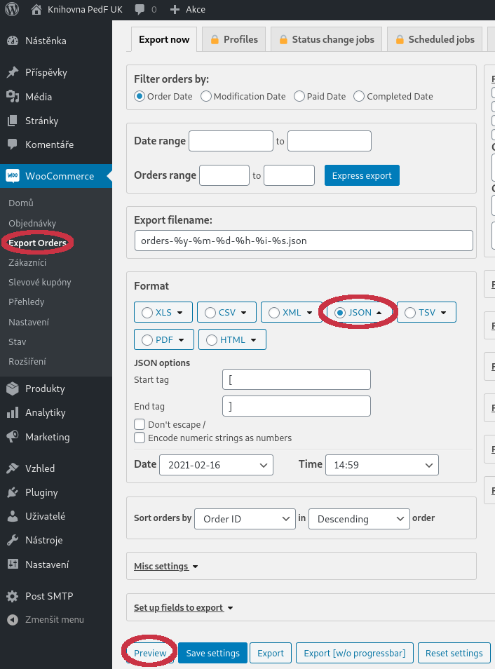
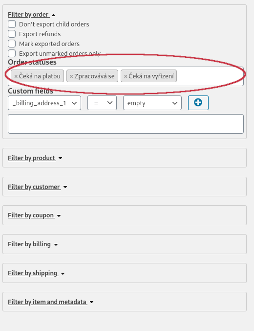

# Tisk objednávek vyřazené literatury

Převod JSON souboru exportovaného z Woocommerce na PDF formulář k tisku.
Potřebuje rozšíření [Advanced Order Export For
WooCommerce](https://wordpress.org/plugins/woo-order-export-lite/)

# Postup

V administračním rozhraní WordPressu vybereme v menu `Woocommerce` položku
`Export Orders`. 

Ve formuláři `Order statuses` je třeba odebrat položku `Dokončeno`.

V levém formuláři pak vybereme formát `JSON` a stiskneme tlačítko `Preview`.

